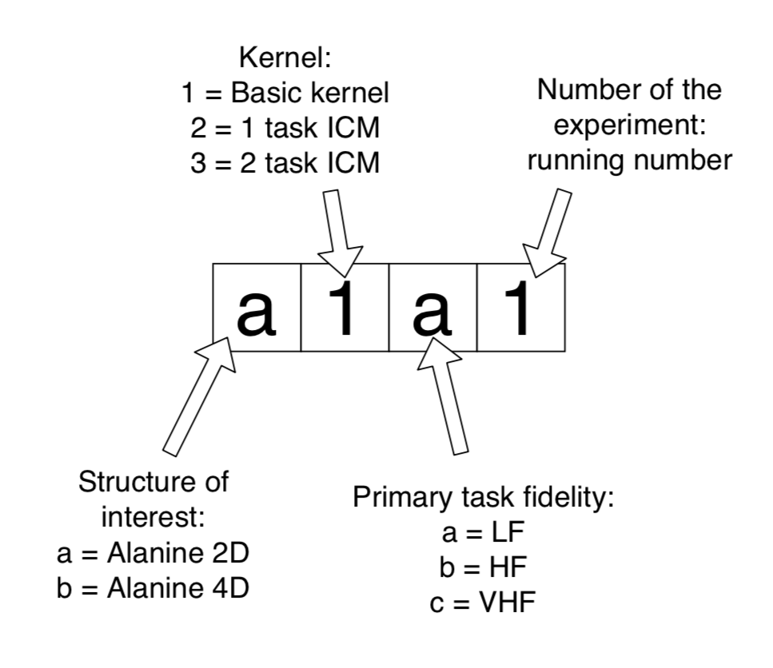

# Accelerating Bayesian Optimization Structure Search with Transfer Learning

Wellcome to BOSS-MT. This repo contains the data analysis scripts used in my 2020 M.Sc. thesis 'Accelerating Bayesian Optimization Structure Search with Transfer Learning'. The purpose of this repository is to allow verifying and reproducing the results of my thesis work. This is not a user manual for using transfer learning with BOSS, or a standalone document. See the BOSS project (references in the thesis) for further information on BOSS use. It is assumed that the user is familiar with the thesis work.

The folder structure is the following:

- data: This folder would contain the raw, unprocessed experiment data. The raw data was not published here because of the large size and unconventional metadata. processed_data contains the data in a cleaned, easy-to-use format. The raw data is available by request from the BOSS project.

- processed_data: Raw data (boss.out files) parsed to json format for analysis.

- results: figures and tables created by the analysis scripts are created here.

- src: Analysis scripts and config files.

- visuals: repository visualization

## Understanding the experiments

Each folder in data / processed data contains output of one experiment. Each experiment is named with a 4 character code as follows:

Most experiments contain multiple BOSS runs. Each boss run is named exp_N, where N is a running number. The settings in all runs under same experiment are equal, but the number of secondary data, and the initialization data itself, may vary for statistics depending on the experiment.\
Processed data is in json format. You can load data of each run to python dictionary with python json module using <code>json.load(filepath)</code>.
The setup for each experiment run can be seen from "boss.in" keyword. Relevant settings are also listed under their own keywords. Use <code>.keys()</code> function to list all the keywords for a setup.

## Reproducing the analysis

The analysis pipelines in this project are managed by [Snakemake](https://snakemake.readthedocs.io/en/stable/).
All the analysis is completely reproducible. The main input file for running the analysis is the Snakefile, that can be found here in the root folder.
To run the analysis pipeline, copy clone this repository\
<code>git clone git@github.com:NuuttiSten/BOSS-MT.git</code>\
install [anaconda](https://www.anaconda.com) virtual environment with the [requirements](https://github.com/NuuttiSten/BOSS-MT/blob/master/requirements.txt)\
<code>conda create --name stenthesis --file requirements.txt </code>,\
launch the environment\
<code>conda activate stenthesis</code>\
and run Snakemake with\
<code>snakemake</code>.\
Parsed data is saved under <code>processed_data/</code>.\
Final analysis outputs are stored to <code>results/</code>.\
Running the whole analysis pipeline takes about 15 minutes.

## Citing the work
To cite, use:

Sten, N. A. 2020. 'Accelerating Bayesian Optimization Structure Search with Transfer Learning'. M.Sc. Thesis. Aalto University, Espoo, Finland.

or load [bibtex citation](https://github.com/NuuttiSten/BOSS-MT/blob/master/sten2020accelerating.bib).
